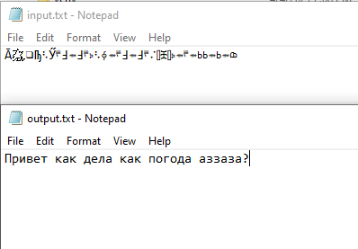

# Encryptor

### Как запустить?
1. `git clone https://github.com/FoxThings/Encryptor.git`
2. Запускаем через консоль

### Аргументы командной строки
#### Общий синтаксис: 
`python main.py [вид шифра] [путь входного файла] [путь выходного файла] [ключ] [язык]`

Последние 2 аргумента опциональны: ключ = '0', язык = rus

### Виды шифров:
- Шифр Цезаря
- Шифр Вернама
- Шифр Виженера
- Автоматический дешифратор шифра Цезаря
- RSA
- Генератор ключа для RSA
- Поточный шифр (бесконечный ключ)
#### Шифр Цезаря
`python main.py caesar .....`

Ключ должен быть числом! При положительном числе происходит шифрование, а при отрицательном - дешифрование.
#### Шифр Вернама
`python main.py vernam ..... [ключ]`

Здесь аргумент языка не используется. Шифр является симметричным, поэтому для дешифрования нужно запустить шифратор ещё раз с тем же ключом.
#### Шифр Виженера
`python main.py vigener_enc .....` - шифратор

`python main.py vigener_dec .....` - дешифратор

Для дешифрования нужно использовать тот же ключ и язык, какой и при шифровании!
Ключ должен быть из того же языка!
#### Автоматическое дешифровании шифра Цезаря
`python main.py caesar_dec [путь входного файла] [путь выходного файла]`

В выходной файл записываются все возможные варианты расшифровки. Нужно найти что-то осмысленное.

#### Генерация ключей RSA
`python main.py rsa_keygen [путь входного файла] [путь выходного файла]`

Во входном файле должны лежать 2 простых числа, разделённые пробелом. 
В выходной запишутся публичный и приватный ключи. Аргумент языка не используется.

#### RSA шифрование
`python main.py rsa [путь входного файла] [путь выходного файла] "(num, num)"`

Ключ должен быть в формате "(число, число)"

Используйте публичный ключ для шифрования, а приватный для дешифрования. Аргумент языка не используется.

#### Поточное шифрование
`python main.py stream [путь входного файла] [путь выходного файла] key`

В этом виде шифрования генерируется бесконечный ключ по входному ключу. Шифр является симметричным, поэтому для дешифрования нужно запустить шифратор ещё раз с тем же ключом.
Аргумент языка не используется.

Надеюсь я не призвал сатану :/

### Примеры
`python main.py caesar .\input.txt .\output.txt 20 rus` - шифрование шифром Цезаря

`python main.py vigener_enc .\input.txt .\output.txt ЯключДляШифрования rus` - шифрование шифром Виженера

`python main.py caesar_dec .\input.txt .\output.txt` - автоматическое дешифрование шифра Цезаря

`python main.py rsa .\input.txt .\output.txt "(5, 16199)"` - шифрование RSA

`python main.py vigener_enc .\input.txt .\output.txt ЯключДляШифрования` - Поточное шифрование

### Примечания
1. Для шифра Виженера лучше всего использовать ключ такой же длины как и входные данные
2. Символы '.!?:;,_-\n\r\t ' игнорируются в шифрах Цезаря и Виженера
